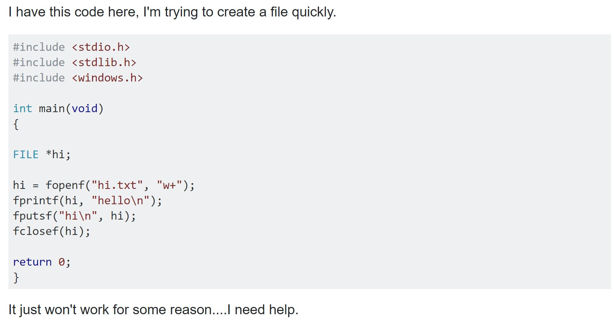
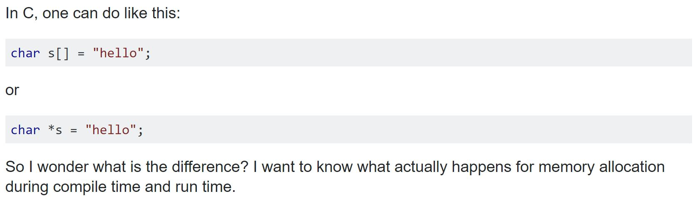

## So Many Questions!
As a computer engineer, there is no shortage of questions that I have relating to my coursework.  Many of my questions can be answered by searching Google or consulting the textbook.  Easier questions like "why does my code not print out X" can even be answered by simply reviewing the task at hand with a fresh eye.  However, some questions are more difficult and lead me to seek help from my friends and my professor.  Often times these more difficult questions are shared amongst my classmates and by asking them leads to collaboration.

When asking questions to my classmates or to my professor, I want to have a clear understanding of my problem so that I can explain my problem concisely.  I also want to have an explaination prepared of what I have looked into to answer my own question.  In general, I want to show that I am competent of my own problem and am ready to receive help from whoever I am asking.

## Good and Bad Questions
These preparations that I take help me ask better questions and allow me to receive good answers.  Had I not taken these steps to prepare my question before asking, it's trivial to think that I would have asked a bad question in its place.  A bad question in this context meaning less-prepared, unintelligent, and unclear.  It is for this reason that asking questions demands the necessary preparation and thought to be considered by others (who know more about the subject then you do) as good ones and worth their time to explain an answer.  To view some examples of good and bad questions, lets look at questions asked on Stack Overflow.

## Stack Overflow: Programming Questions
Stack Overflow is a website where people can ask questions and receive help on programming topics.  These questions are answered by skilled programmers who volunteer their time in giving insight to questions for everyone to see.  Stack Overflow tends to be filled with unanswered questions resulting in people being selective in which questions they respond to.  While the majority of questions on Stack Overflow are good questions, there are bad ones that get an appropriate amount of internet flame.

Here is an example of a bad question.  This question can be found on Stack Overflow [here](http://stackoverflow.com/questions/41753315/how-to-create-a-file-in-c).

  

Lightly put, this question is bad.  What makes this a bad question is that it lacks specifically that, a question.  Nowhere in the post is there a specific question to be answered.  Instead, the asker puts forth their source code and states that they are having trouble with gettin it to work.  From the perspective of a person answering this post, there is also no insight as to what the asker wanted the code to do in detail.

Here is an example of a good question.   This question can be found on Stack Overflow [here](http://stackoverflow.com/questions/1704407/what-is-the-difference-between-char-s-and-char-s-in-c).

  

This is an example of a good question.  Despite being short, question being asked is simple and straightforward.  By providing small snippets of code, the asker can illustrate exactly what their question is referring to.  By explaining that he would like to more about how the two lines of code differ in terms of memory management, it makes answering the question worthwhile and straightforward.

## Good Questions make Good Engineers
As engineers, we owe it to ourselves to ask each other good questions.  When we ask good questions, we can get meaningful answers in return that can lead to engaging conversation.  If you want to read more about the differences between good and bad questions, I highly recommend giving Eric Steven Raymond's [article](http://www.catb.org/esr/faqs/smart-questions.html#explicit) on "How To Ask Questions The Smart Way" a read.
