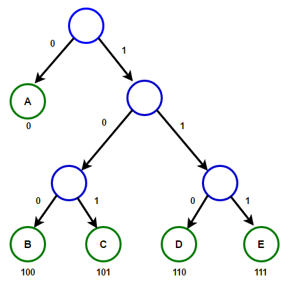

  

### Huffman Coding

A Huffman code is a data compression code used to reduce the storage footprint of data files.  After compression, the code can later be used to decompress the file into its original form.  These compression/decompression techniques are useful anywhere there is a need to compress repetitive data files.  You may have already used tools which utilize Huffman code such as .jpeg and .png files.

### Reflection

I found this assignment to be very challenging as it was an individual project and it encompassed many different learning topics at once.  Before the project, I had limited experience in the algorithms involved with data compression, decompression, and binary search trees.  These topics were being taught just prior to me starting the project.  It is also the largest program that I have written up to that point, involving roughly 10 code files.  These had to all work with one another to first produce the compressed data file and later decompress it.  Overall, this project gave me confidence in my ability figure out things on my own and also to create and manage larger files of code.

Source: <a href="https://github.com/cfrifel/Huffman_code"><i class="large github icon "></i>Huffman Code</a>

