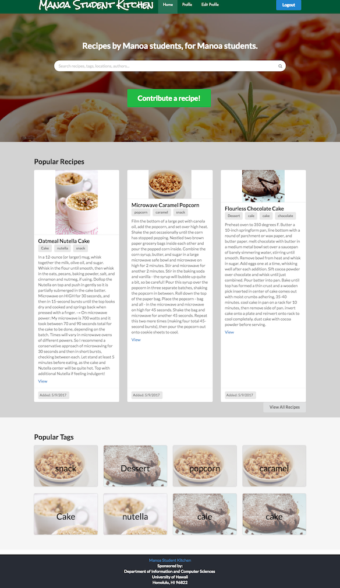

### Overview
College students are very busy people and often don't make their own meals.  Whether it's because they have too little time, experience, or money, making meals is not something every college student does.  This is where we struck the inspiration behind Manoa Student Kitchen.

Manoa Student Kitchen is a web application designed to offer UH Manoa students a way to create and share simple recipes with fellow students.  Because college students have limited access to kitchen appliances, emphasis is placed on uploading recipes that are simple enough for a college student to make.  When creating a recipe, students can recommend locations at which to obtain a specific ingredient and at what cost.  Fellow students can then read where get the required ingredients when viewing the recipe.

### My Contribution
I worked in a team of three to complete this project.  My contribution focused on providing users with a way to create and edit their own user profile.  The idea behind having a user profile is that students can gain easy access to their created recipes, recipes that they have saved for future reference, and follow the activities of fellow students.  During the first milestone, I contributed toward getting the application started and building a simple user profile front-end.  For the second milestone, I finished the final look-and-feel of the user profile page and started a profiles collection back-end.  For the third milestone, I struggled with bridging the profiles collection with the user-interface.  With the help of my teammates, the basic functions needed for the UI to pull from the profiles collection were implemented.

### Lessons Learned
This was the first large-scale coding project that I worked on in a team, which brought along many challenges related to using Git/Github and project management skills.  After working through this project, I have a solid understanding of HTML, CSS, and Javascript and how to put them all together to make a Meteor application.  I got to develop all parts of the web application stack and bridge the two using Javascript.  

For more information about our web application, <a href="https://manoastudentkitchen.github.io/">click here</a> to view the github.io website.

