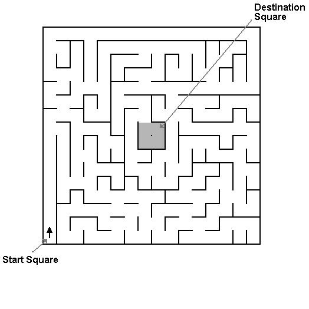

  

### Overview
Micromouse is an event in which a small autonomous robot “mouse” navigates its way through a maze.  The maze is a 16 by 16 cell grid with both a starting corner for the initial mouse position and an empty 2 by 2 space in the center of the maze.  The maze is also filled with a random distribution of horizontally and vertically placed walls that give the maze its maze-like properties.  The mice that attempt to solve the maze are completely autonomous and must find their way to the center space of the maze from the start square unaided.  Therefore, mice will need to keep track of where they are, discover and record walls as it explores, and detect when it has reached the goal.  When a shortest route has been discovered, the mouse will run that route as fast as it can.

### Reflection
For this project, I was the lead programmer and was responsible for programming the mouse's behavior and maze-solving algorithm.  I started by programming the motors to move forwards and backwards and also turn left and right.  From there, I figured out how to enable interrupts as well as read data from the analog rangefinders.  Combining these, I got the mouse to detect walls around it and move within the maze without crashes.  Next, I moved on to program the mouse to follow the right-wall to find the maze center.  With all of this, my team was able to solve the maze within the 10 minute allotted time period.

You can learn more at the [UH Micromouse Website](http://www-ee.eng.hawaii.edu/~mmouse/about.html).

