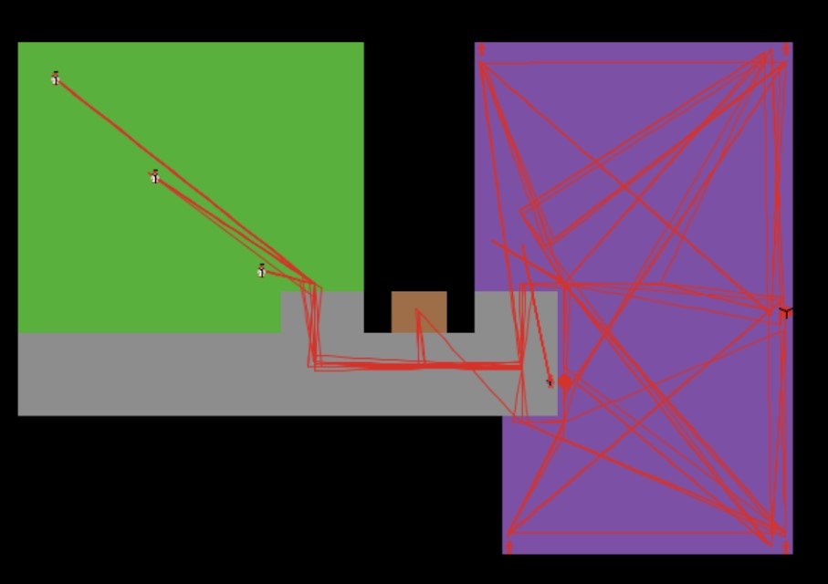

  

### TL;DR
This project focused on developing a computer simulation to model the propagation of Hospital Associated Infections in a hospital based on adjustable parameters and implementing that simulation in the real-world.

### Links
Our NetLogo simulation code is hosted on Github <a href="https://github.com/cfrifel/ee496-senior-project">here</a>.

## Warning: Lengthy final report incoming
### 1  Abstract
This project developed a NetLogo simulation to model the propagation of Hospital Associated Infections (HAIs) in a medical care center. The layout of the simulation matched the layout of the John A. Burn’s School of Medicine’s (JABSOM) SimTiki Simulation Center. The simulation features several parameters which can be adjusted to model different HAIs and keeps a log of all contacts between agents. A movement script derived from motion studies of healthcare workers was programmed in the simulation for all moving agents. An SIR (susceptible, infected, recovered) model was programmed to track the infectious state of agents in the simulation. All the data generated from the simulation is captured in a MySQL database. Monte Carlo simulations were conducted and analyzed. A physical trial was conducted at the SimTiki Center that mimics the movement script for the NetLogo simulation. The two sets of contact log data were analyzed and compared to validate the accuracy of the physical trial.

### 2  Introduction
HAIs are defined as infections a person contracts while in a healthcare facility [1]. HAIs can be contracted by healthcare workers, patients, and visitors in a hospital environment. In the United States, HAIs are responsible for 99,000 deaths and 33 billion dollars in healthcare costs [2]. When an HAI outbreak occurs, an Infection Control Officer (ICO) is sent in to interview the healthcare workers and patients. During these interviews, the ICO asks the interviewee who they were in contact with and when to generate a list of contacts between them. With this contact list, the ICO can try to predict the source of the infection as well as predict persons who may have contracted the infection but are not yet showing symptoms [4]. This method of generating contacts carries with it two major flaws. One being the amount of uncertainty that arises from gathering information based on people’s ability to remember who they met with and when. The other flaw is that this method is prone to omitting interactions with hospital visitors and fomites such as computer stations or supply facilities. As a result, this method is likely to generate an incomplete list of contacts which adds difficulty when predicting the spread of the outbreak. This larger goal of this project is aimed at automating this process of contact tracing. This project represents a first step toward achieving an automated contact tracing system. The remainder of this report is organized as follows. In section 3, the design methods and project modules are explained in a logical order. In section 4, results of the project are explained and elaborated. Section 5 covers anticipated future work to be done during the fall 2017 semester and beyond. In section 6, the project is analyzed with respect to engineering standards. Section 7 contains concluding remarks.

### 3  Design methodology
#### 3.1  Layout

[Figure 1.  John A. Burn's School of Medicine SimTiki Simulation Center]

The NetLogo simulation was modeled after the JABSOM SimTiki Simulation Center shown in figure 1. This layout was chosen to provide realism within the simulation. A physical trial in the SimTiki Simulation Center would later be conducted.

[Figure 2. NetLogo simulation layout with agents]

As shown in figure 2, the NetLogo simulation closely resembles the layout of the JABSOM SimTiki Simulation Center. The assorted colors in figure 2 denote separate rooms within the simulation. The staff room is colored green, the ward room purple, the hallway grey, and the isolation room brown.

Figure 2 shows a snapshot of the NetLogo simulation populated with several “agents.” In this project, an agent is defined as either a healthcare worker, patient, visitor, or fomite. There are ten agents in the simulation which include three healthcare workers, four patients, one visitor, a computer station and a supply station. As seen in figure 2, the healthcare workers are situated in the green staff room, the patients are in the four corners of the ward room, the visitor waits just outside of the ward room in the hallway, and the computer and supply station are placed near the middle of the ward room.

In all rooms except the isolation room, agents can interact with other agents and generate contact data. When an agent moves into the isolation room, they’re presence becomes invisible to the other agents and are unable to generate contact data. This allows the simulation to model a moving agent leaving and returning to the simulation.

### References
[1] "AHRQ's Efforts to Prevent and Reduce Health Care-Associated Infections." *AHRQ—Agency for Healthcare Research and Quality: Advancing Excellence in Health Care.* U.S. HHS:
Agency for Healthcare Research and Quality, 02 Oct. 2014. Web. 10 May. 2017.
